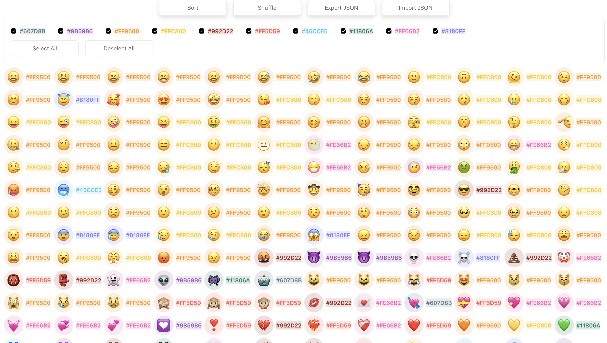

# Emoji Average Color

A tool to visualize and manage emoji color palettes. This project helps you map emojis to their closest matching colors from a predefined palette.



## 🔗 Demo

Try it live: [Emoji Average Color Demo](https://dwt6g2.csb.app)

## ✨ Features

- View emojis with their matched colors
- Filter emojis by color
- Sort and shuffle emoji display
- Export/Import emoji-color mappings as JSON
- Import custom color palettes
- Interactive color selection interface

## 🛠️ Usage

- **Sort/Shuffle**: Organize emojis either alphabetically or randomly
- **Export JSON**: Download the current emoji-color mappings
- **Import JSON**: Load a previously exported emoji-color mapping
- **Import Palette**: Load a custom color palette (JSON array of hex colors)
- **Color Filters**: Use checkboxes to filter emojis by their matched colors

## 🚀 Technologies

- React
- TypeScript
- Geist UI
- React Virtual Grid

## 📝 Palette File Format

```json
[
  "#FF0000",
  "#00FF00",
  "#0000FF"
]
```

### Emoji-Color JSON 

```json
{
  "😀": "#FF0000",
  "😁": "#00FF00",
  "😂": "#0000FF"
}
```